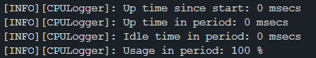
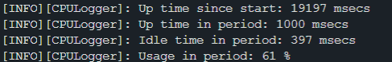

# Codelab : Bike Computer Part II

## Question 1 : CPULogger

Créons l'attribut `_cpuLogger` dans bike_system.hpp :

```cpp
advembsof::CPULogger _cpuLogger;
```

et utilisons le dans bike_system.cpp :

```cpp
BikeSystem::BikeSystem()
    : ...
      _cpuLogger(_timer) {}

void BikeSystem::start() {
    ...
    while (true) {
        tasks ...
        _cpuLogger.printStats();
    }
```

Voici le résultat affiché dans la console :


On remarque que l'utilisation du CPU est de 100%.

## Question 2 : De l'attente active au sleep_for

Dans les fonctions 'temparatureTask', 'displayTask1', et 'displayTask2', on remplace l'attente active (boucle while) par un sleep_for :

```cpp
void BikeSystem::task() {
    auto taskStartTime = _timer.elapsed_time();

    // task execution
    ...

    auto taskEndTime = _timer.elapsed_time();

    ThisThread::sleep_for((kTaskComputationTime.count() -
                           (taskEndTime - taskStartTime).count() / 1000));
}
```
NEANMOINS CELA N'A AUCUN IMPACT SUR LE CPU : 

J'imagine donc que le problème vient d'autre part.


