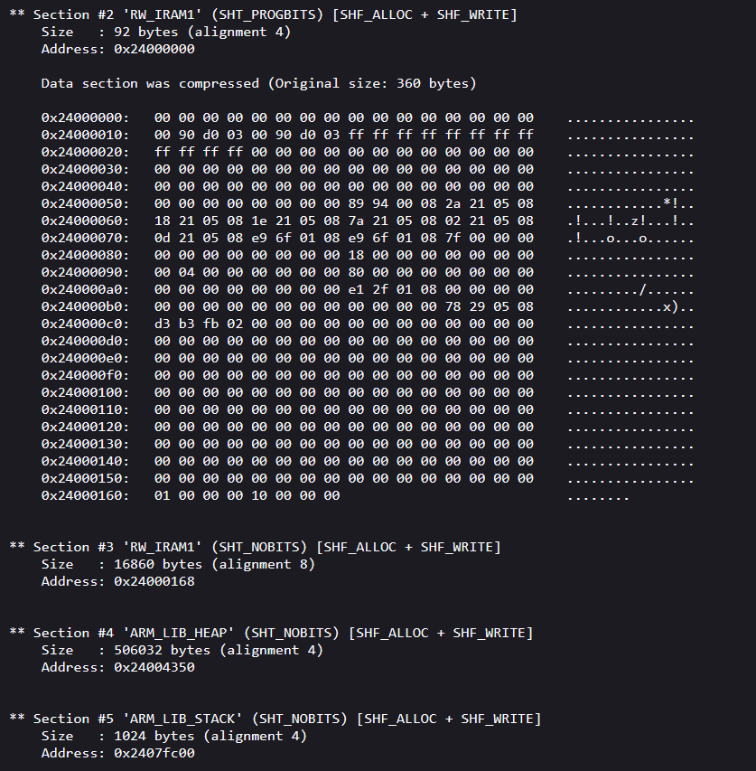

# Memory Profiling And Optimization Exercises

- [Memory Profiling And Optimization Exercises](#memory-profiling-and-optimization-exercises)
  - [Exercise 1 : AXI-SRAM](#exercise-1--axi-sram)
  - [Exercise 2 : Bootup sequence to main](#exercise-2--bootup-sequence-to-main)
  - [Exercise 3 : Memap](#exercise-3--memap)
  - [Exercise 4 : Different output library](#exercise-4--different-output-library)
  - [Exercise 5 : Dynamic memory analysis](#exercise-5--dynamic-memory-analysis)
  - [Exercice 6 : Stack OVerflow](#exercice-6--stack-overflow)

## Exercise 1 : AXI-SRAM

En se fiant au manuel de référence fourni (page 136), on peut savoir que la région AXI SRAM est stockée dans la RAM entre les adresses 0x24000000 et 0x2407FFFF.


En allant voir dans le document d'analyse (`BUILD\DISCO_H747I\ARMC6\bike-computer_application.elf`), on peut remarquer que la plage d'adresse précédente s'étale sur les sections 2 à 5 (comprises).



EXPLICATIONS ?

## Exercise 2 : Bootup sequence to main

## Exercise 3 : Memap

Après avoir modifié la fonction main() dans notre main.cpp, nous pouvons compiler pour exécuter memap. En voici les résultats :

```
Space used after regions merged: 0x51264
| Module                     |        .text |    .data |        .bss |
|----------------------------|--------------|----------|-------------|
| [lib]\c_w.l                |   4644(+116) |   16(+0) |   576(+228) |
| [lib]\fz_wv.l              |      634(+0) |    0(+0) |       0(+0) |
| [lib]\libcpp_w.l           |        1(+0) |    0(+0) |       0(+0) |
| [lib]\libcppabi_w.l        |       44(+0) |    0(+0) |       0(+0) |
| advdembsof_library\display |   165494(+0) |    0(+0) |     528(+0) |
| advdembsof_library\sensors |      666(+0) |    0(+0) |       0(+0) |
| advdembsof_library\utils   |      372(+0) |   24(+0) |       0(+0) |
| anon$$obj.o                |       32(+0) |    0(+0) |    1024(+0) |
| disco_h747i\CM7            |       52(+0) |    0(+0) |       0(+0) |
| disco_h747i\Drivers        |     4801(+0) |    0(+0) |     585(+0) |
| disco_h747i\Wrappers       |    77336(+0) |    0(+0) |     517(+0) |
| mbed-os\cmsis              |    12605(+0) |  168(+0) |    6993(+0) |
| mbed-os\connectivity       |       16(+0) |    0(+0) |       0(+0) |
| mbed-os\drivers            |    5797(-50) |    0(+0) |       0(+0) |
| mbed-os\events             |     1636(+0) |    0(+0) |       0(+0) |
| mbed-os\hal                |     2476(+0) |    8(+0) |     114(+0) |
| mbed-os\platform           |    11379(+0) |  128(+0) |    1220(+0) |
| mbed-os\rtos               |     1422(+0) |    0(+0) |       8(+0) |
| mbed-os\storage            |       54(+0) |    0(+0) |       4(+0) |
| mbed-os\targets            |    36359(+0) |   13(+0) |    2399(+0) |
| src\common                 |      436(+0) |    0(+0) |       0(+0) |
| src\main.o                 |    333(+221) |  40(+40) |       4(+4) |
| src\multi_tasking          |    2311(-40) |    0(+0) |       0(+0) |
| Subtotals                  | 328900(+247) | 397(+40) | 13972(+232) |
Total Static RAM memory (data + bss): 14369(+272) bytes
Total Flash memory (text + data): 329297(+287) bytes
```

## Exercise 4 : Different output library

Après avoir modifié `mbed-app.json` pour passer de 'minimal-printf' à 'std', comme indiqué dans l'énoncé, voici le résultat de memap lors de la compilation :

```
Space used after regions merged: 0x52294
| Module                     |         .text |   .data |      .bss |
|----------------------------|---------------|---------|-----------|
| [lib]\c_w.l                |  11541(+6897) |  16(+0) |   576(+0) |
| [lib]\fz_wv.l              |     130(-504) |   0(+0) |     0(+0) |
| [lib]\libcpp_w.l           |         1(+0) |   0(+0) |     0(+0) |
| [lib]\libcppabi_w.l        |        44(+0) |   0(+0) |     0(+0) |
| [lib]\m_wv.l               |       48(+48) |   0(+0) |     0(+0) |
| advdembsof_library\display |    165494(+0) |   0(+0) |   528(+0) |
| advdembsof_library\sensors |       666(+0) |   0(+0) |     0(+0) |
| advdembsof_library\utils   |       372(+0) |  24(+0) |     0(+0) |
| anon$$obj.o                |        32(+0) |   0(+0) |  1024(+0) |
| disco_h747i\CM7            |        52(+0) |   0(+0) |     0(+0) |
| disco_h747i\Drivers        |      4801(+0) |   0(+0) |   585(+0) |
| disco_h747i\Wrappers       |     77336(+0) |   0(+0) |   517(+0) |
| mbed-os\cmsis              |     12605(+0) | 168(+0) |  6993(+0) |
| mbed-os\connectivity       |        16(+0) |   0(+0) |     0(+0) |
| mbed-os\drivers            |      5797(+0) |   0(+0) |     0(+0) |
| mbed-os\events             |      1636(+0) |   0(+0) |     0(+0) |
| mbed-os\hal                |      2476(+0) |   8(+0) |   114(+0) |
| mbed-os\platform           |   9143(-2236) | 128(+0) |  1220(+0) |
| mbed-os\rtos               |      1422(+0) |   0(+0) |     8(+0) |
| mbed-os\storage            |        54(+0) |   0(+0) |     4(+0) |
| mbed-os\targets            |     36359(+0) |  13(+0) |  2399(+0) |
| src\common                 |       436(+0) |   0(+0) |     0(+0) |
| src\main.o                 |       333(+0) |  40(+0) |     4(+0) |
| src\multi_tasking          |      2311(+0) |   0(+0) |     0(+0) |
| Subtotals                  | 333105(+4205) | 397(+0) | 13972(+0) |
Total Static RAM memory (data + bss): 14369(+0) bytes
Total Flash memory (text + data): 333502(+4205) bytes
```

C'EST CHELOU, AU LIEUX DE GAGNER DE LA PLACE, ON EN A PERDU

## Exercise 5 : Dynamic memory analysis

Tout d'abord, ajoutons notre memory logger dans BikeSystem::start(), comme indiqué dans l'énoncé : audépart du programme, puis de manière régulière.

```cpp
void BikeSystem::start() {
    tr_info("Starting multi tasking");

    init();

    osStatus status =
        _thread.start(callback(&_eventQueueISR, &EventQueue::dispatch_forever));
    tr_debug("Thread %s started with status %d", _thread.get_name(), status);

    _memoryLogger.getAndPrintStatistics();

    ...

    Event<void()> memoryStatsEvent(&eventQueuePeriodic,
                                callback(&_memoryLogger, &advembsof::MemoryLogger::printDiffs));
    memoryStatsEvent.delay(kMajorCycleDuration);
    memoryStatsEvent.period(kMajorCycleDuration);
    memoryStatsEvent.post();

    ...
}
```

Lors du lancement de l'application, ces lignes apparaissent dans la console Serial :

```
[INFO][BikeSystem]: Starting multi tasking
[DBG ][BikeDisplay]: Display initialized
[DBG ][BikeSystem]: Thread ISR_Thread started with status 0
[DBG ][MemoryLogger]: MemoryStats (Heap):
[DBG ][MemoryLogger]:   Bytes allocated currently: 7060
[DBG ][MemoryLogger]:   Max bytes allocated at a given time: 7060
[DBG ][MemoryLogger]:   Cumulative sum of bytes ever allocated: 7060
[DBG ][MemoryLogger]:   Current number of bytes allocated for the heap: 509868
[DBG ][MemoryLogger]:   Current number of allocations: 10
[DBG ][MemoryLogger]:   Number of failed allocations: 0
[DBG ][MemoryLogger]: Cumulative Stack Info:
[DBG ][MemoryLogger]:   Maximum number of bytes used on the stack: 3272
[DBG ][MemoryLogger]:   Current number of bytes allocated for the stack: 9856
[DBG ][MemoryLogger]:   Number of stacks stats accumulated in the structure: 4
[DBG ][MemoryLogger]: Thread Stack Info:
[DBG ][MemoryLogger]:   Thread: 0
[DBG ][MemoryLogger]:           Thread Id: 0x240026b8 with name main
[DBG ][MemoryLogger]:           Maximum number of bytes used on the stack: 2592
[DBG ][MemoryLogger]:           Current number of bytes allocated for the stack: 4096
[DBG ][MemoryLogger]:           Number of stacks stats accumulated in the structure: 1
[DBG ][MemoryLogger]:   Thread: 1
[DBG ][MemoryLogger]:           Thread Id: 0x24002630 with name rtx_idle
[DBG ][MemoryLogger]:           Maximum number of bytes used on the stack: 320
[DBG ][MemoryLogger]:           Current number of bytes allocated for the stack: 896
[DBG ][MemoryLogger]:           Number of stacks stats accumulated in the structure: 1
[DBG ][MemoryLogger]:   Thread: 2
[DBG ][MemoryLogger]:           Thread Id: 0x24002674 with name rtx_timer
[DBG ][MemoryLogger]:           Maximum number of bytes used on the stack: 96
[DBG ][MemoryLogger]:           Current number of bytes allocated for the stack: 768
[DBG ][MemoryLogger]:           Number of stacks stats accumulated in the structure: 1
[DBG ][MemoryLogger]:   Thread: 3
[DBG ][MemoryLogger]:           Thread Id: 0x240019c4 with name ISR_Thread
[DBG ][MemoryLogger]:           Maximum number of bytes used on the stack: 264
[DBG ][MemoryLogger]:           Current number of bytes allocated for the stack: 4096
[DBG ][MemoryLogger]:           Number of stacks stats accumulated in the structure: 1
[DBG ][MemoryLogger]: Thread Info:
[DBG ][MemoryLogger]:   Thread: 0
[DBG ][MemoryLogger]:           Thread Id: 0x240026b8 with name main, state Running, priority 24
[DBG ][MemoryLogger]:           Stack size 4096 (free bytes remaining 1504)
[DBG ][MemoryLogger]:   Thread: 1
[DBG ][MemoryLogger]:           Thread Id: 0x24002630 with name rtx_idle, state Ready, priority 1
[DBG ][MemoryLogger]:           Stack size 896 (free bytes remaining 576)
[DBG ][MemoryLogger]:   Thread: 2
[DBG ][MemoryLogger]:           Thread Id: 0x24002674 with name rtx_timer, state Waiting, priority 40
[DBG ][MemoryLogger]:           Stack size 768 (free bytes remaining 672)
[DBG ][MemoryLogger]:   Thread: 3
[DBG ][MemoryLogger]:           Thread Id: 0x240019c4 with name ISR_Thread, state Waiting, priority 24
[DBG ][MemoryLogger]:           Stack size 4096 (free bytes remaining 3832)
[DBG ][MemoryLogger]: MemoryStats (Heap):
[DBG ][MemoryLogger]:   Bytes allocated increased by 1680 to 8740 bytes
[DBG ][MemoryLogger]:   Max bytes allocated at a given time increased by 1680 to 8740 bytes (max heap size is 509868 bytes)
[DBG ][MemoryLogger]: Cumulative Stack Info:
[DBG ][MemoryLogger]:   Maximum number of bytes used on the stack increased by 280 to 3552 bytes (stack size is 9856 bytes)
[DBG ][MemoryLogger]: Thread Stack Info:
[DBG ][MemoryLogger]:   Thread: 0
[DBG ][MemoryLogger]:           Thread Id: 0x240026b8 with name main
[DBG ][MemoryLogger]:           Maximum number of bytes used on the stack increased by 280 to 2872 bytes (stack size is 4096 bytes)
```

Ensuite de manière régulière, les différences sont affichées :

```
[DBG ][MemoryLogger]: MemoryStats (Heap):
[DBG ][MemoryLogger]: Cumulative Stack Info:
[DBG ][MemoryLogger]: Thread Stack Info:
```

Cela est un résultat prometteur car il signifie que notre programme ne consomme pas de mémoire (ni dans la Pile, ni dans le Tas) supplémentaire.

Néanmoins, la première fois SEULEUEMENT que l'on presse le bouton de droite, ce message s'affiche :

```
[DBG ][MemoryLogger]: MemoryStats (Heap):
[DBG ][MemoryLogger]: Cumulative Stack Info:
[DBG ][MemoryLogger]:   Maximum number of bytes used on the stack increased by 184 to 3736 bytes (stack size is 9856 bytes)
[DBG ][MemoryLogger]: Thread Stack Info:
[DBG ][MemoryLogger]:   Thread: 3
[DBG ][MemoryLogger]:           Thread Id: 0x240019c4 with name ISR_Thread
[DBG ][MemoryLogger]:           Maximum number of bytes used on the stack increased by 184 to 448 bytes (stack size is 4096 bytes)
```

## Exercice 6 : Stack OVerflow

Mon implémentation pour effectuer un stack overflow (`voir bike_system.cpp` lignes 75 à 82) donne l'erreur suivante :

```
++ MbedOS Error Info ++
Error Status: 0x80020125 Code: 293 Module: 2
Error Message: CMSIS-RTOS error: Stack overflow
Location: 0x80140C1
File: mbed_rtx_handlers.c+60
Error Value: 0x1
Current Thread: main Id: 0x240026B8 Entry: 0x80134C9 StackSize: 0x1000 StackMem: 0x24000D28 SP: 0x2407FF1C
Next:
main  State: 0x2 Entry: 0x080134C9 Stack Size: 0x00001000 Mem: 0x24000D28 SP: 0x240010F8
Ready:
rtx_idle  State: 0x1 Entry: 0x08014231 Stack Size: 0x00000380 Mem: 0x24002700 SP: 0x24002A30
Wait:
rtx_timer  State: 0x83 Entry: 0x08014D81 Stack Size: 0x00000300 Mem: 0x24002A80 SP: 0x24002D20
Delay:
Stack_Overflow_Thread  State: 0x43 Entry: 0x0800D0E1 Stack Size: 0x00001000 Mem: 0x24004700 SP: 0x24005570
For more info, visit: https://mbed.com/s/error?error=0x80020125&osver=61700&core=0x411FC271&comp=1&ver=6160001&tgt=DISCO_H747I
-- MbedOS Error Info --
```

JSP OU EST IMPLEMENTE LA DETECTION DE STACK OVERFLOW DANS RTOS

On peut faire soit même un stack overflow très simplement. J'ai opté pour une fonction récursive sans condition d'arret:

```cpp
int otherStackOverflow(int i) {
    tr_warn("%d", i);
    return otherStackOverflow(i + 1);
}
```